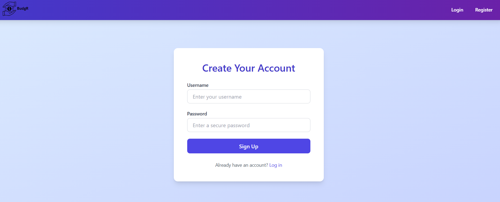
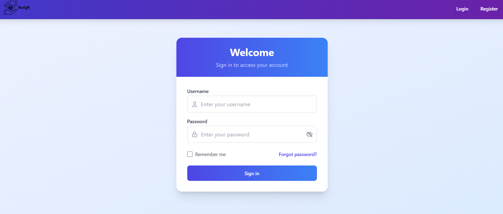
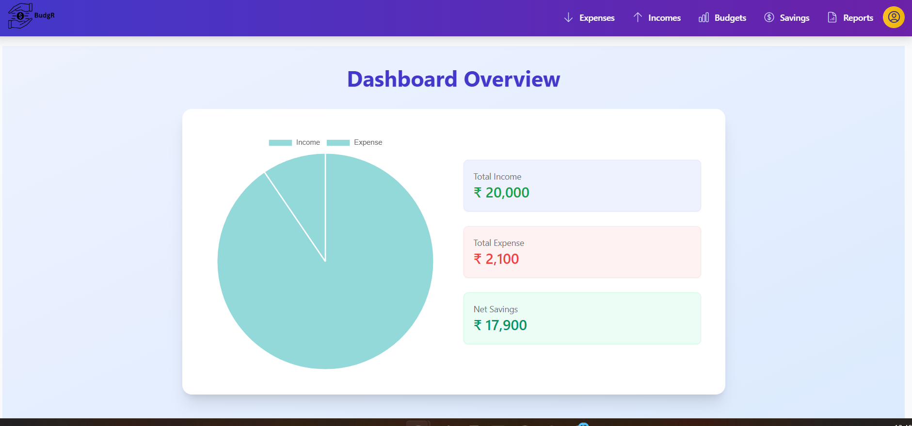
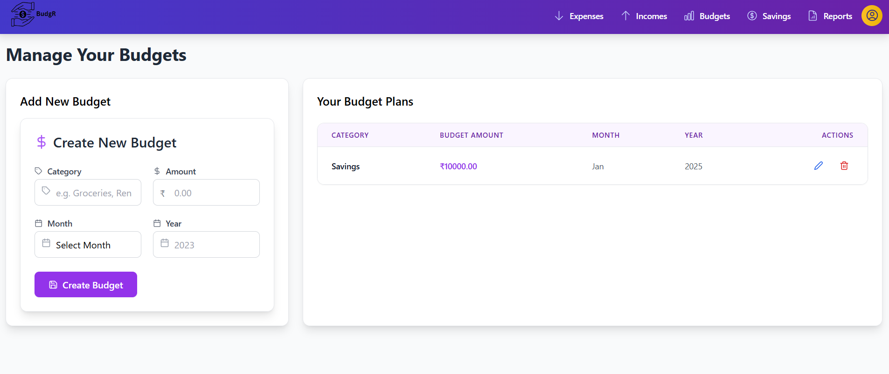
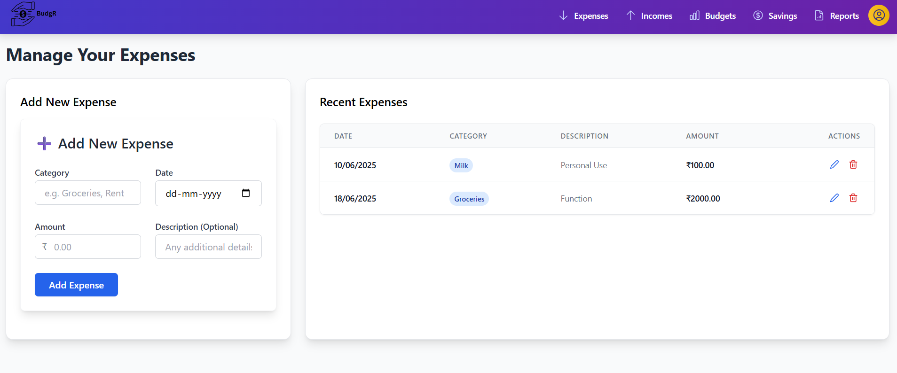
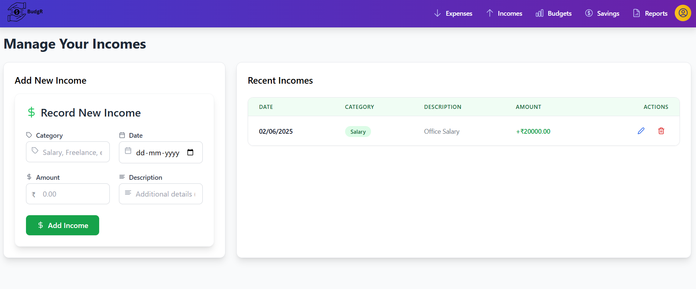
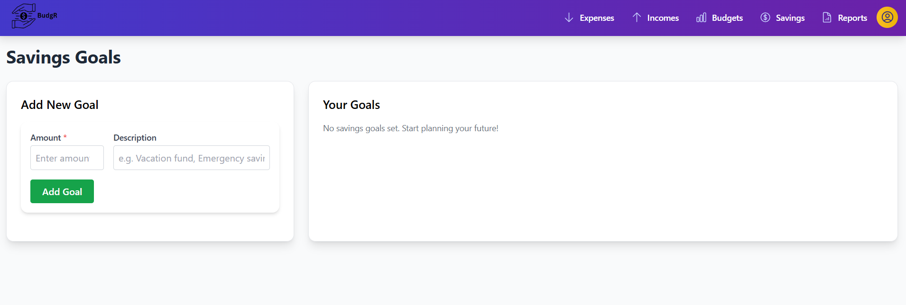
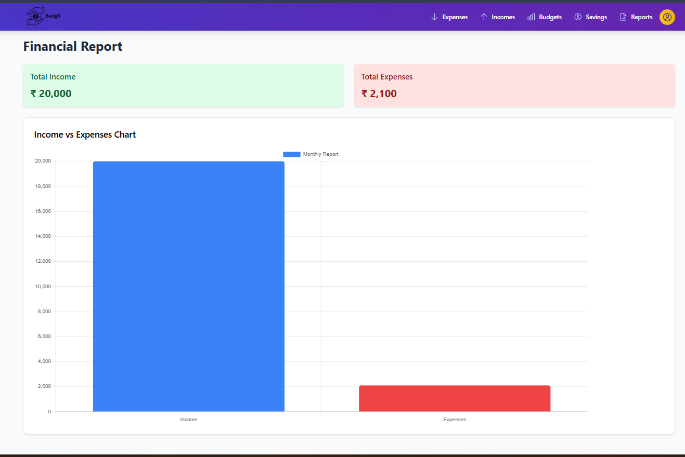

# 💸 Budgr – Personal Finance & Budget Planner

Budgr is a sleek and secure personal finance application that helps users manage incomes, expenses, savings, and visualize monthly financial reports. Built using Spring Boot and React, it offers real-time feedback, JWT-based authentication, and a smooth user experience enhanced with Framer Motion animations.

---

## ✨ Features

- 🔐 JWT-based Authentication (Register/Login)
- 💰 Track Income & Expenses
- 🧾 Manage and Update Savings Goals
- 📊 Visualize Financial Reports with Charts
- 🧠 Clean, Commented Codebase with Logical Flow
- 🎨 Modern UI with Responsive Design and Animations
- 🧼 Backend validation and error handling
- 🔄 RESTful API with full CRUD operations

---

## 📸 Screenshots


 

 
 


---

## 🧪 Tech Stack

### ⚙️ Backend – Spring Boot
- Java 17+
- Spring Boot (RESTful API)
- Spring Security + JWT
- PostgreSQL
- Hibernate / JPA
- Maven
- CORS Configuration
- DTOs & Service Layer
- Exception Handling

### 🎨 Frontend – React JS
- React 18+
- React Router
- Axios
- Framer Motion (Animations)
- TailwindCSS
- Chart.js (Reports)
- Toastify (Alerts)
- Responsive Layout

---

## 🏁 Getting Started

### 🖥️ Backend Setup
```bash
cd budgr_backend
# Configure your PostgreSQL DB in `application.properties`
./mvnw spring-boot:run
```

### 🌐 Frontend Setup
```bash
Copy
Edit
cd frontend
npm install
npm start
```
- Frontend runs on http://localhost:3000
- Backend runs on http://localhost:8080
